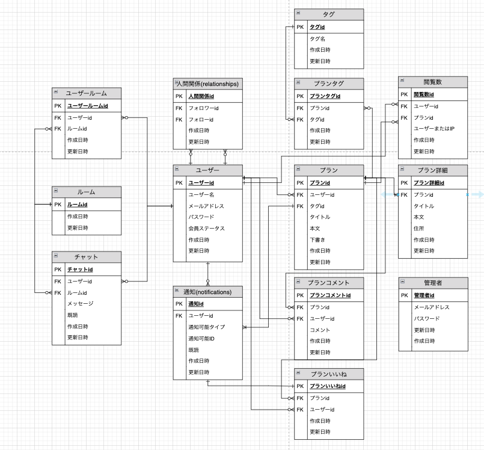

# おでかけplanning


## サイト概要

### サイトテーマ
旅行やデートプランを検索したり、投稿したり、プランを練ることができるSNSサイト
​
### テーマを選んだ理由
もともと私は旅行やデートのプランを練ることが苦手で、同行者に考えてもらうことが多くありました。
プランを考えてくれている同行者に感謝の意を伝えてはいるものの、「第三者に誉めてもらいたい！」といつも言っていました。

旅行やデートの"行き先"ではなく"プラン"を共有するSNSアプリがあれば、
同行者のようなプランを練る側の方がたくさんの方に褒めてもらえるのではないかと考えました。
また、私のようなプランを練ることが苦手な方でも様々なプランを参考にすることができると考え、
このテーマにしました。

### ターゲットユーザ
- 旅行やデートプランを考えることが多く、そのプランを共有したいと考えている人</br>
- 旅行やデートプランを考えることが苦手で、計画を練るのに困っている人
​
### 主な利用シーン
- 既に行った旅行やデートプランを共有するとき</br>
- これから旅行やデートのプランを計画するとき
​
## 設計書
- [ER図](https://drive.google.com/file/d/15grhLVoA1iR_CYBgvsUeSlVAfuTyn3RA/view?usp=sharing)</br>


- [画面設計](https://drive.google.com/file/d/19TVS05AIfo-sN2PRwYX-TYETVygn0dYe/view?usp=sharing)</br>
- [アプリケーション詳細設計](https://docs.google.com/spreadsheets/d/1p9jUsW6a9UnPhSnJ3AfXj1xXQd-eMaf7PlJjr3T-3lw/edit?usp=sharing)</br>
- [テーブル定義書](https://docs.google.com/spreadsheets/d/1bhWUa6Sghs4GUdHWi-0VtcoirksRVA8r4CJDG-33rck/edit?usp=sharing)</br>
- [画面遷移図](https://www.figma.com/design/te6oY9hhH464bylYuSoaZj/go_out_planning?node-id=0-1&t=4VhfMvfmlsP8mZMi-1)

## テスト
##### RSpecテスト
- 投稿モデルテスト（保存・バリデーション)
- ユーザーモデルテスト（保存・バリデーション)
- システムテスト（新規登録・ログイン・投稿・編集・削除）

## GitHub
##### Githubアクション（自動化)
- RSpecテスト</br>
- デプロイ

##### Github運用ルール
- mainブランチは常にリリース（デプロイ）できるような状態にある
- developブランチを統合ブランチとする
- トピックブランチは全てdevelopブランチから派生させる
- 不具合発生時、Issuesで管理

|ブランチ名      |役割                       |派生元  |マージ先  |
|----------------|---------------------------|--------|----------|
|main            |公開するものを置くブランチ |        |　        |
|develop         |開発中のものを置くブランチ |main    |main      |
|feature/*       |機能実装中に使うブランチ   |develop |develop   |
|fix/*           |機能修正中に使うブランチ   |develop |develop   |

__コミットメッセージの記法__

`feature:機能実装`
`add:追加`
`delete:削除`
`fix:不具合修正`
`update:更新`
`close #:Issuesをclose`

## 使用技術
[](https://skillicons.dev)

## 開発環境
- OS：Linux(CentOS)
- 言語：HTML,CSS,JavaScript,Ruby,SQL
- フレームワーク：Ruby on Rails
- JSライブラリ：jQuery
- IDE：Cloud9

## Gem

```
gem 'devise'
gem 'geocoder'
gem 'gmaps4rails'
```

## 使用素材

- Canva</br>
- https://www.canva.com/ja_jp/learn/commercial-use/#commercial-use</br>

- ICOOON MONO</br>
- https://icooon-mono.com/license/</br>

- 引用元の指示に従って利用します</br>

著作権を考慮し、架空のデータを扱う予定です。</br>
なお今後、実在するデータを利用する際には、事前に著作権保持者と契約を結んだ上で利用します。
